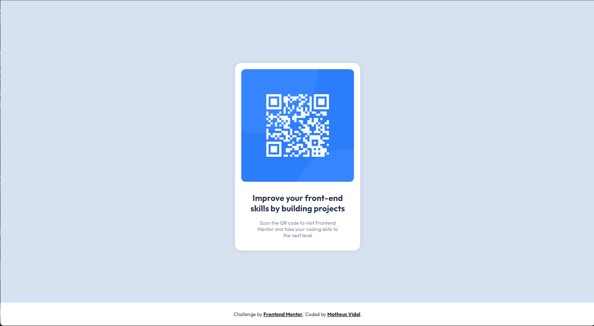

# Frontend Mentor - QR code component solution

This is a solution to the [QR code component challenge on Frontend Mentor](https://www.frontendmentor.io/challenges/qr-code-component-iux_sIO_H). Frontend Mentor challenges help you improve your coding skills by building realistic projects. 

## Table of contents

- [Overview](#overview)
  - [Screenshot](#screenshot)
  - [Links](#links)
- [My process](#my-process)
  - [Built with](#built-with)
- [Author](#author)

## Overview

### Screenshot

### Link

- Live Site URL: [Deploy on Vercel.](https://qr-code-component-qymp.vercel.app/)

## My process
### Built with

- Semantic HTML5 markup
- CSS custom properties
- Flexbox
- [StyleLint](https://stylelint.io/) - A mighty CSS linter that helps you avoid errors and enforce conventions.

## Author

- Twitter - [@vidownzera](https://www.twitter.com/vidownzera)
- Frontend Mentor - [@matheuszvidal](https://www.frontendmentor.io/profile/matheuszvidal)

